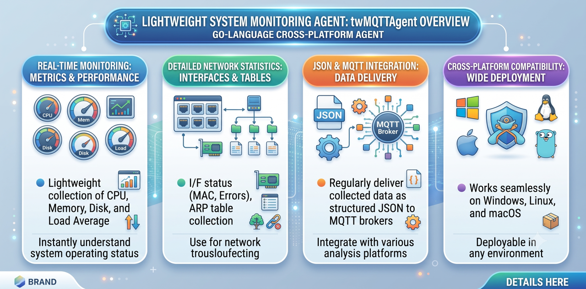

# twMQTTAgent

`twMQTTAgent` is a lightweight, cross-platform system monitoring agent written in Go. It collects system metrics (CPU, Memory, Load, Network, Processes) and publishes them to an MQTT broker in JSON format. It is designed as a modern extension for the **TWSNMP** series.

[日本語の説明](./README_ja.md)



---

## Features

- **System Metrics Monitoring:** Gathers real-time performance indicators:
  - CPU usage (%)
  - Memory usage (%)
  - Load average
  - Network Traffic (Sent/Received bytes, Tx/Rx speed)
  - Active process count
- **Network Interface Statistics:** Gathers detailed adapter statistics (MTU, MAC address, operational status, errors, drops, packets sent/received) when `-if-interval` is set.
- **ARP Table Monitoring:** Periodically dumps the ARP table when `-arp-interval` is set.
- **MQTT Integration:** Publishes all collected telemetry data as JSON payloads to a specified MQTT broker.
- **Cross-Platform:** Works on Windows, Linux, and macOS.

## Configuration & Usage

`twMQTTAgent` is configured using command-line flags.

### CLI Flags

| Flag | Default | Description |
|---|---|---|
| `-broker` | `tcp://localhost:1883` | MQTT broker URL (e.g., `tcp://192.168.1.1:1883`) |
| `-client-id` | `twMQTTAgent` | MQTT client ID |
| `-topic` | `twMQTTAgent` | Base MQTT topic prefix. The hostname and message type are appended (e.g., `<topic>/Monitor/<hostname>`) |
| `-interval` | `30` | Publish interval for system metrics (Monitor) in seconds |
| `-if-interval` | `0` | Publish interval for interface stats (IF) in seconds (`0` to disable) |
| `-arp-interval` | `0` | Publish interval for ARP table (Arp) in seconds (`0` to disable) |
| `-user` | | MQTT username (optional) |
| `-password` | | MQTT password (optional) |
| `-hostname` | | Hostname used in topic and payload (defaults to system hostname if empty) |

### Running the Agent

```bash
# Basic usage sending metrics every 60 seconds
./twMQTTAgent -broker tcp://192.168.1.50:1883 -topic myhome/monitor -interval 60

# Running with interface and ARP monitoring enabled
./twMQTTAgent -broker tcp://192.168.1.50:1883 -if-interval 300 -arp-interval 600
```

---

## Development & Build

This project uses `mise` for tool versioning and task runner workflows.

### Prerequisites
- Go 1.21+

### Build Commands

Using `go` toolchain directly:
```bash
# Build for local platform
go build -o twMQTTAgent
```

Using `mise`:
```bash
# Run locally for testing
mise run run

# Build for current host architecture
mise run build:local

# Cross-compile for Windows and Linux
mise run build:all
```

---

## JSON Payload Formats

### System Metrics (Topic: `<topic>/Monitor/<hostname>`)
```json
{
  "time": "2026-07-02T05:28:08+09:00",
  "host": "my-pc-name",
  "cpu": 12.5,
  "memory": 53.1,
  "load": 1.45,
  "sent": 1024,
  "recv": 2048,
  "tx_speed": 0.15,
  "rx_speed": 0.30,
  "process": 120
}
```

### Interface Statistics (Topic: `<topic>/IF/<hostname>`)
```json
{
  "time": "2026-07-02T05:28:08+09:00",
  "host": "my-pc-name",
  "interfaces": [
    {
      "index": 1,
      "name": "eth0",
      "mtu": 1500,
      "mac": "00:11:22:33:44:55",
      "status": "up",
      "addrs": ["192.168.1.100/24"],
      "bytes_recv": 2048,
      "bytes_sent": 1024,
      "packets_recv": 20,
      "packets_sent": 15,
      "err_in": 0,
      "err_out": 0,
      "drop_in": 0,
      "drop_out": 0
    }
  ]
}
```

### ARP Table (Topic: `<topic>/Arp/<hostname>`)
```json
{
  "time": "2026-07-02T05:28:08+09:00",
  "host": "my-pc-name",
  "arp": [
    {
      "ip": "192.168.1.1",
      "mac": "00:11:22:33:44:55",
      "interface": "eth0",
      "type": "dynamic"
    }
  ]
}
```

---

## License

This project is licensed under the MIT License - see the [LICENSE](LICENSE) file for details.